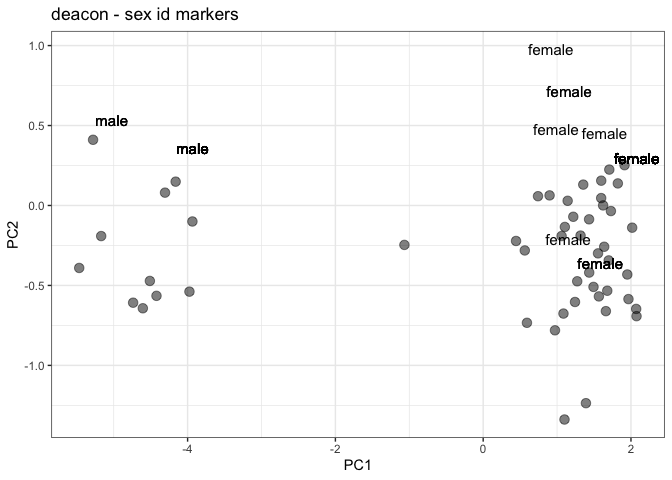

deacon-sex-id
================
diana baetscher
2024-02-14

Walkthrough for unknown samples:

Using the rds file output from microhaplot: 1. read in rds files 2.
apply read depth filters 3. apply allele balance filter

``` r
library(tidyverse)
```

    ## ── Attaching core tidyverse packages ──────────────────────── tidyverse 2.0.0 ──
    ## ✔ dplyr     1.1.3     ✔ readr     2.1.4
    ## ✔ forcats   1.0.0     ✔ stringr   1.5.0
    ## ✔ ggplot2   3.4.4     ✔ tibble    3.2.1
    ## ✔ lubridate 1.9.3     ✔ tidyr     1.3.0
    ## ✔ purrr     1.0.2     
    ## ── Conflicts ────────────────────────────────────────── tidyverse_conflicts() ──
    ## ✖ dplyr::filter() masks stats::filter()
    ## ✖ dplyr::lag()    masks stats::lag()
    ## ℹ Use the conflicted package (<http://conflicted.r-lib.org/>) to force all conflicts to become errors

``` r
library(readxl)
library(stringr)
library(lubridate)
library(rubias)
library(ggpattern)


source("../R/rockfish-funcs2.R")


#### Call genos from the microhaplot rds files ####

# the directory with the rds file
dir <- "../data/rds_files/"


# cycle over them, read them and add the gtseq_run column on each.
# at the end, bind them together.
genos_long <- call_genos_from_haplotRDS(path = file.path(dir, "deacon_sex_id.rds"))
```

    ## Warning: `tbl_df()` was deprecated in dplyr 1.0.0.
    ## ℹ Please use `tibble::as_tibble()` instead.
    ## Call `lifecycle::last_lifecycle_warnings()` to see where this warning was
    ## generated.

    ## Warning: `tbl_df()` was deprecated in dplyr 1.0.0.
    ## ℹ Please use `tibble::as_tibble()` instead.
    ## Call `lifecycle::last_lifecycle_warnings()` to see where this warning was
    ## generated.

    ## Joining with `by = join_by(id, locus, rank)`

``` r
#### In the end, let us get a data frame that includes genotypes for all the individuals  ####
# and which explicitly has NAs in places where data are missing
genos_long_explicit_NAs <- genos_long %>%
  select(id) %>%
  unique() %>%
  unlist() %>%
  unname() %>%
  expand.grid(id = ., locus = unique(genos_long$locus), gene_copy = 1:2, stringsAsFactors = FALSE) %>%
  tbl_df() %>% 
  left_join(., genos_long) %>%
  arrange(id, locus, gene_copy) %>%
    mutate(id = str_replace(id, "s", ""))
```

    ## Warning: `tbl_df()` was deprecated in dplyr 1.0.0.
    ## ℹ Please use `tibble::as_tibble()` instead.
    ## Call `lifecycle::last_lifecycle_warnings()` to see where this warning was
    ## generated.

    ## Joining with `by = join_by(id, locus, gene_copy)`

``` r
# alleles have Ns because I didn't trim the reference
genos_long_explicit_NAs %>%
  ggplot(aes(x = locus, y = id, fill = depth)) +
  geom_tile()
```

<!-- -->
One individual didn’t genotype.

``` r
# samplesheet
ss <- read_csv("../data/20240212_OgoGT1_deaconSexID.csv", skip = 19) %>%
  mutate(s_id = row_number()) %>%
   mutate(Sample_ID = str_replace(Sample_ID, "ABLG", ""))
```

    ## Rows: 148 Columns: 9
    ## ── Column specification ────────────────────────────────────────────────────────
    ## Delimiter: ","
    ## chr (7): Sample_ID, Sample_Plate, Sample_Well, I7_Index_ID, index, index2, S...
    ## lgl (2): I5_Index_ID, Description
    ## 
    ## ℹ Use `spec()` to retrieve the full column specification for this data.
    ## ℹ Specify the column types or set `show_col_types = FALSE` to quiet this message.

``` r
ss$s_id <- as.character(ss$s_id)

# ABLG numbers
meta <- read_xlsx("../data/deacons_to_gtseq.xlsx")
meta$ABLG <- as.character(meta$ABLG)

sex <- meta %>%
  select(ABLG, Sex)

# add sex info to the samplesheet
deacon_sex_genos <- ss %>%
  select(Sample_ID, s_id) %>%
  left_join(., sex, by = c("Sample_ID" = "ABLG")) %>%
  inner_join(., genos_long_explicit_NAs, by = c("s_id" = "id"))
```

``` r
# first make integers of the alleles
alle_idxs <- deacon_sex_genos %>% 
  filter(s_id != 141) %>% # missing all four loci
  dplyr::select(Sample_ID, locus, gene_copy, allele, Sex) %>%
  group_by(locus) %>%
  mutate(alleidx = as.integer(factor(allele, levels = unique(allele)))) %>%
  ungroup() %>%
  arrange(Sample_ID, locus, alleidx) # rubias can handle NA's, so no need to change them to 0's

  
# and spread the alleles
two_col <- alle_idxs %>%
  #group_by(indiv, locus) %>%
  unite(loc, locus, gene_copy, sep = ".") %>%
  #ungroup() %>%
  select(-allele) %>%
  pivot_wider(names_from = loc, values_from = alleidx) 
```

## Make a PCA to separate female/males

``` r
library(DescTools)

samples_for_pca <- alle_idxs %>%
  rename(INDIVIDUALS = Sample_ID, STRATA = Sex, MARKERS = locus, GT = alleidx) %>%
  filter(!str_detect(INDIVIDUALS, "NTC")) # Remove NTCs at this point because they are missing nearly all markers.
  

samples_for_pca
```

    ## # A tibble: 408 × 6
    ##    INDIVIDUALS MARKERS      gene_copy allele   STRATA    GT
    ##    <chr>       <chr>            <int> <chr>    <chr>  <int>
    ##  1 10575       CLocus_1008          1 NCN      female     1
    ##  2 10575       CLocus_1008          2 NCN      female     1
    ##  3 10575       CLocus_18110         1 AC       female     1
    ##  4 10575       CLocus_18110         2 AC       female     1
    ##  5 10575       CLocus_31643         1 NCG      female     1
    ##  6 10575       CLocus_31643         2 NCG      female     1
    ##  7 10575       CLocus_33227         1 NGGATTTN female     1
    ##  8 10575       CLocus_33227         2 NGGATTTN female     1
    ##  9 10576       CLocus_1008          1 NCN      female     1
    ## 10 10576       CLocus_1008          2 NCN      female     1
    ## # ℹ 398 more rows

``` r
# reformat genotypes for genind conversion
# create 3 digit integers from the genotypes
samples_for_pca$GT3 <- DescTools::Format(samples_for_pca$GT, ldigits = 3, digits = 0)
      
# fix NAs
long_df0s <- samples_for_pca %>%
  mutate(GT3 = ifelse(is.na(GT3), "000", GT3))
      
# Now combine the GT3 column per indiv/marker:
# make the genos characters and then try pasting them as strings
long_df0s$GT3 <- as.character(long_df0s$GT3)
      
long_df3digit <- long_df0s %>%
  group_by(INDIVIDUALS, MARKERS) %>% 
  arrange(GT3, .by_group = TRUE) %>% 
  summarise(GENOTYPE = toString(GT3)) %>%
  ungroup()
```

    ## `summarise()` has grouped output by 'INDIVIDUALS'. You can override using the
    ## `.groups` argument.

``` r
# paste strings together
long_df3digit$GENOTYPE <- gsub(", ","",long_df3digit$GENOTYPE)
      
# add back on species identity as strata
df_for_conversion <- long_df0s %>% 
  select(-GT, -GT3, -MARKERS) %>%
  unique() %>%
  left_join(., long_df3digit) %>%
  rename(GT = GENOTYPE) %>%
  mutate(GT = ifelse(GT == "000000", NA, GT))
```

    ## Joining with `by = join_by(INDIVIDUALS)`

    ## Warning in left_join(., long_df3digit): Detected an unexpected many-to-many relationship between `x` and `y`.
    ## ℹ Row 1 of `x` matches multiple rows in `y`.
    ## ℹ Row 1 of `y` matches multiple rows in `x`.
    ## ℹ If a many-to-many relationship is expected, set `relationship =
    ##   "many-to-many"` to silence this warning.

``` r
df_for_conversion$STRATA <- as.factor(df_for_conversion$STRATA)
      
# use the radiator package for this conversion
library(radiator)

pop_genind_df <- radiator::write_genind(df_for_conversion)
   
# Now that the data is a genind object, we can do all sorts of things using the adegenet package.
# Allele presence absence data are extracted and NAs replaced using tab:
library(adegenet)
```

    ## Loading required package: ade4
    ## 
    ##    /// adegenet 2.1.10 is loaded ////////////
    ## 
    ##    > overview: '?adegenet'
    ##    > tutorials/doc/questions: 'adegenetWeb()' 
    ##    > bug reports/feature requests: adegenetIssues()

``` r
pop_dataset <- adegenet::tab(pop_genind_df) # double check that is this the appropriate method: options are "as is", "mean", or "zero"
# frequency - should the data be transformed to relative frequencies
      
# PCA
dataset_pop1 <- dudi.pca(pop_dataset, nf = 6, scannf = F, center = T) # I lowered this based on the screeplot

pop_pca_df <- rownames_to_column(dataset_pop1$li, var = "indiv")

as_tibble(pop_genind_df@strata) %>%
  left_join(., pop_pca_df, by = c("INDIVIDUALS" = "indiv")) %>%
  ggplot(aes(x = Axis1, y = Axis2, label = INDIVIDUALS)) +
  geom_jitter(width = 0.5, height = 0.5, size = 3, alpha = 0.5) +
  geom_text(nudge_x = 0.5, nudge_y = 0.5, size = 4) +
  theme_bw() +
  labs(title = "deacon - sex id markers",
       x = "PC1",
       y = "PC2")
```

<!-- -->

``` r
as_tibble(pop_genind_df@strata) %>%
  left_join(., pop_pca_df, by = c("INDIVIDUALS" = "indiv")) %>%
  filter(INDIVIDUALS != "10628") %>% # remove the outlier
   ggplot(aes(x = Axis1, y = Axis2, label = STRATA)) +
  geom_jitter(width = 0.5, height = 0.5, size = 3, alpha = 0.5) +
  geom_text(nudge_x = 0.5, nudge_y = 0.5, size = 4) +
  theme_bw() +
  labs(title = "deacon - sex id markers",
       x = "PC1",
       y = "PC2")
```

    ## Warning: Removed 3 rows containing missing values (`geom_text()`).

<!-- -->

That looks decent. What are the unknowns?

``` r
as_tibble(pop_genind_df@strata) %>%
  left_join(., pop_pca_df, by = c("INDIVIDUALS" = "indiv")) %>%
  filter(is.na(STRATA))
```

    ## # A tibble: 3 × 8
    ##   INDIVIDUALS STRATA Axis1  Axis2 Axis3   Axis4  Axis5   Axis6
    ##   <chr>       <fct>  <dbl>  <dbl> <dbl>   <dbl>  <dbl>   <dbl>
    ## 1 34228       <NA>    1.58 -0.201 0.545  0.0633 -0.179 -0.0949
    ## 2 34229       <NA>    1.58 -0.201 0.545  0.0633 -0.179 -0.0949
    ## 3 34230       <NA>   -1.32 -0.144 1.17  -0.0229  1.14  -1.26

Based on PC1, the first two are female and the third is male.

ABLG numbers 34228 and 34229 are female and 34230 is male.
